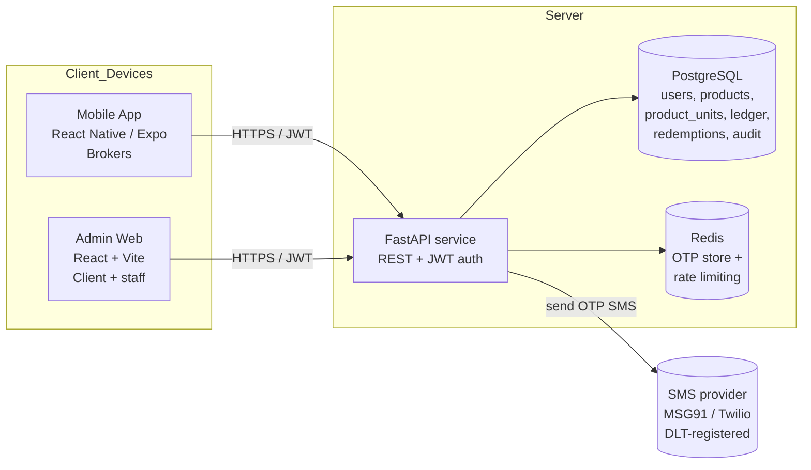
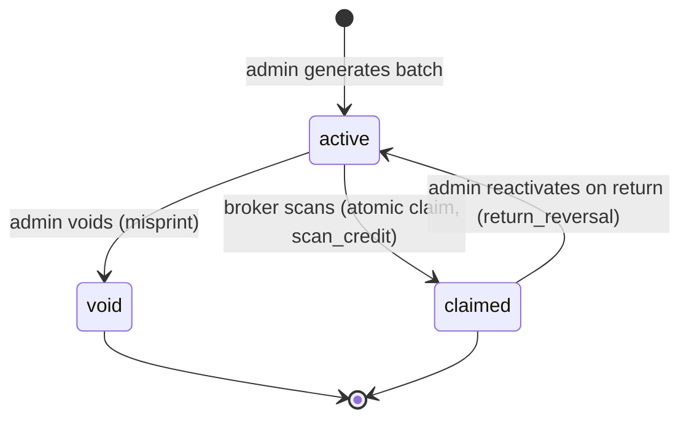
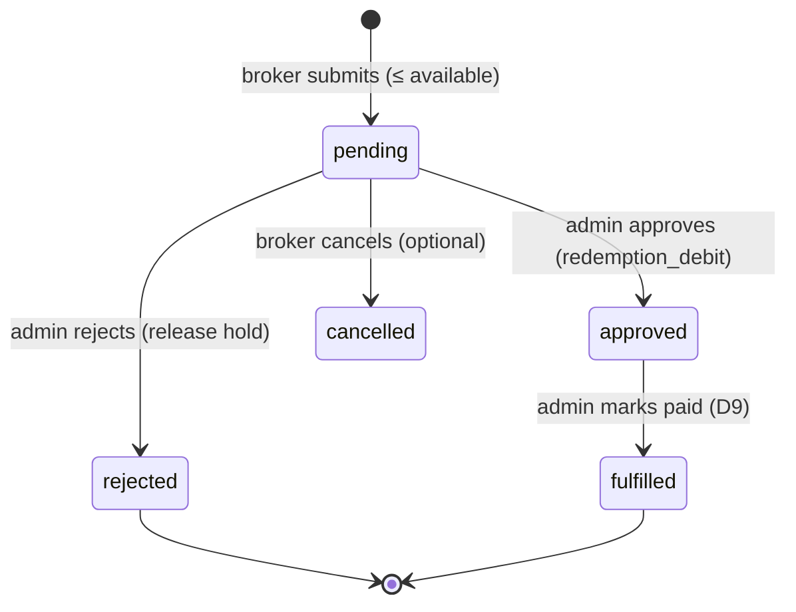

# Technical Specification — QR Rewards & Loyalty Platform

**Companion to:** `PRD.md`
**Status:** Draft v1
**Scope:** Backend API, data model, mobile app, admin web. Single-tenant, ~200 users.

---

## 1. System architecture

Three deployables against one shared backend:



**Why this shape:** the workload is CRUD + a few integrity-critical transactions (claim, redeem, reverse), not compute- or AI-heavy. A single stateless FastAPI service backed by Postgres is the correct, low-ops design for ~200 users. Redis is optional but recommended for OTP + rate limiting (Postgres can substitute at this scale).

---

## 2. Tech stack

| Layer | Choice | Rationale / alternative |
|---|---|---|
| **Backend** | Python 3.12 + **FastAPI**, Uvicorn | Matches team's Python/Pydantic strength; great for typed REST. Alt: Node/NestJS. |
| **ORM / migrations** | **SQLAlchemy 2.x** + Alembic | Mature, transaction control for atomic claims. |
| **Validation** | **Pydantic v2** | Request/response schemas, settings. |
| **DB** | **PostgreSQL 16** | Relational integrity, row locking, JSONB for audit metadata. |
| **OTP/rate-limit store** | **Redis 7** (optional) | Fast TTL keys for OTP + counters. Postgres fallback at this scale. |
| **QR generation** | `qrcode[pil]` (Python) + `reportlab` for PDF sheets | Server-side batch generation + printable export. |
| **SMS / OTP delivery** | **MSG91** (India, DLT-ready). Alt: Twilio, or **Firebase Phone Auth** (offloads OTP entirely) | See §7.1. |
| **Mobile** | **React Native via Expo (managed)** | Cross-platform, fast distribution via EAS. |
| → scanning | **`expo-camera`** `CameraView` (`onBarcodeScanned`, `barcodeScannerSettings={{ barcodeTypes: ['qr'] }}`) | `expo-barcode-scanner` is **deprecated** (since SDK 51) — do **not** use it. Heavy-duty alt: `react-native-vision-camera`. |
| → storage / nav / data | `expo-secure-store`, React Navigation, **TanStack Query** | Secure token, navigation, server-state caching. |
| **Admin web** | **React + Vite + TypeScript**, **Ant Design** (data-dense tables/forms) | Fast admin dashboards. Alt: shadcn/ui + Tailwind. |
| → webcam scan (returns) | `html5-qrcode` | In-browser QR scan for reactivation. |
| → data fetching | TanStack Query + Axios | — |
| **Auth** | JWT (access + refresh); `python-jose`/PyJWT; passwords via `argon2`/`bcrypt` | Separate broker vs admin token audiences. |
| **Hosting** | Backend+DB on Railway/Render/Fly.io; admin on Vercel/Netlify; mobile via **EAS Build** → APK/store | Right-sized PaaS. |

> ⚠️ Expo SDK note: there is a known SDK 55 iOS report where in-camera barcode scanning was disabled despite config (`expo/expo#44491`). Pin to a known-good SDK and verify scanning on a real device early; keep `react-native-vision-camera` as the fallback path.

---

## 3. Data model

### 3.1 Entities (PostgreSQL)

All tables: `id UUID PK DEFAULT gen_random_uuid()`, `created_at timestamptz DEFAULT now()`, `updated_at` where mutable.

#### `admins`
| col | type | notes |
|---|---|---|
| email | text unique not null | login |
| password_hash | text not null | argon2/bcrypt |
| name | text | |
| role | text default `'operator'` | `owner` \| `operator` |
| is_active | bool default true | |

#### `users` (brokers)
| col | type | notes |
|---|---|---|
| phone | text unique not null | E.164, e.g. `+9198...` — identity |
| name | text not null | captured at signup |
| is_verified | bool default false | OTP-verified |
| is_active | bool default true | admin can disable |
| last_active_at | timestamptz | |

> Balance is **not** stored as a column of truth — it is derived from `ledger_entries` (§3.3). Optionally cache it in a `balance_cache` column updated within the same transaction as ledger writes, for fast lists.

#### `products`
| col | type | notes |
|---|---|---|
| name | text not null | |
| description | text | |
| points_value | integer not null check (>= 0) | credited on scan |
| is_active | bool default true | |

#### `product_units` — one row per physical item / QR
| col | type | notes |
|---|---|---|
| product_id | uuid fk → products | |
| token | text unique not null | **unguessable**; the value encoded in the QR (UUIDv4 or HMAC). Indexed. |
| status | text not null default `'active'` | `active` \| `claimed` \| `void` |
| batch_id | uuid fk → qr_batches (nullable) | grouping for export |
| claimed_by_user_id | uuid fk → users (nullable) | set on claim |
| claimed_at | timestamptz (nullable) | |

Indexes: `unique(token)`, `index(product_id)`, `index(status)`, `index(batch_id)`.

#### `qr_batches` — a generation run for printable export
| col | type | notes |
|---|---|---|
| product_id | uuid fk → products | |
| quantity | integer not null | |
| created_by_admin_id | uuid fk → admins | |
| label | text | e.g. "Jan 2026 — SKU-A — 500 units" |

#### `ledger_entries` — **append-only** point movements (source of truth)
| col | type | notes |
|---|---|---|
| user_id | uuid fk → users not null | whose balance |
| amount | integer not null | **signed**: credits +, debits − |
| type | text not null | `scan_credit` \| `return_reversal` \| `redemption_hold` \| `redemption_debit` \| `redemption_release` \| `admin_credit` \| `admin_debit` |
| product_unit_id | uuid fk (nullable) | for scan/return |
| redemption_id | uuid fk (nullable) | for redemption-related |
| admin_id | uuid fk (nullable) | for admin adjustments |
| note | text | reason |
| metadata | jsonb | free-form context |

Indexes: `index(user_id, created_at desc)`, `index(type)`.
**Never UPDATE/DELETE.** Corrections = new compensating entries.

> **Hold modeling (choose one, recommend A):**
> **A. Hold via ledger** — on request: insert `redemption_hold` (−amount). On approve: `redemption_debit` is *0/no-op* (hold already removed the points) and request marked approved. On reject: `redemption_release` (+amount). Simple: available balance = SUM(ledger). Pending = sum of open holds tracked via `redemptions.status`.
> **B. Hold via status only** — points stay in ledger; available = SUM(ledger) − SUM(pending request amounts). Debit on approve, nothing on reject.
> Spec uses **B** for clarity below (balance math is explicit), but A is acceptable — pick one and keep it consistent.

#### `redemption_requests`
| col | type | notes |
|---|---|---|
| user_id | uuid fk → users | |
| points | integer not null check (> 0) | requested |
| status | text not null default `'pending'` | `pending` \| `approved` \| `rejected` \| `fulfilled` (D9) |
| processed_by_admin_id | uuid fk (nullable) | |
| processed_at | timestamptz (nullable) | |
| note | text | admin note |

Index: `index(status)`, `index(user_id, created_at desc)`.

#### `audit_logs`
| col | type | notes |
|---|---|---|
| actor_admin_id | uuid fk (nullable) | who |
| action | text not null | `credit`, `debit`, `reactivate_unit`, `void_unit`, `approve_redemption`, `reject_redemption`, `create_product`, `generate_batch`, ... |
| entity_type | text | `user` \| `product_unit` \| `redemption` ... |
| entity_id | uuid | |
| metadata | jsonb | before/after, amounts, notes |

#### OTP (Redis preferred, else table)
- Redis key: `otp:{phone}` → `{code_hash, attempts, expires_at}` TTL ~5 min.
- Rate-limit keys: `otp_send:{phone}` (cooldown), `otp_send_daily:{phone}` / `:{ip}` (daily cap).

### 3.2 Balance & availability (model B)
```
balance(user)            = SUM(ledger_entries.amount WHERE user_id = u)
pending(user)            = SUM(redemption_requests.points WHERE user_id = u AND status = 'pending')
available(user)          = balance(user) - pending(user)
```
Redemption request is allowed iff `points <= available(user)`.

### 3.3 Ledger entry types → effect
| type | sign | trigger |
|---|---|---|
| `scan_credit` | + product.points_value | successful claim |
| `return_reversal` | − original credit | admin reactivates returned unit |
| `redemption_debit` | − points | admin approves redemption |
| `admin_credit` | + | admin manual credit |
| `admin_debit` | − | admin manual debit |

(With model A, add `redemption_hold` / `redemption_release`.)

---

## 4. Product-unit (QR) lifecycle — state machine



**Invariants:**
- A unit transitions `active → claimed` **at most once per active period**, and only via the atomic claim (§5).
- `claimed → active` is admin-only (return) and **must** write a reversing ledger entry in the same transaction.
- `void` is terminal for claimability; a voided unit can never be claimed.

---

## 5. The atomic claim (most important logic)

Concurrency-safe single-scan is the crux. Two brokers must never both earn points for one code.

**Algorithm (single DB transaction):**
1. Resolve `token` → unit. If none → `404 invalid_code`.
2. If `unit.status == 'void'` → `409 code_void`.
3. If `unit.status == 'claimed'`:
   - if `claimed_by_user_id == current_user` → **idempotent success**: return the existing `scan_credit` (FR-S5).
   - else → `409 already_claimed` with `claimed_at` (FR-S3).
4. If `unit.status == 'active'`: perform an **atomic conditional update**:
   ```sql
   UPDATE product_units
      SET status = 'claimed', claimed_by_user_id = :uid, claimed_at = now()
    WHERE id = :unit_id AND status = 'active'
   RETURNING id;
   ```
   - If 0 rows returned, another request won the race → re-read and branch to step 3.
   - If 1 row returned, insert `ledger_entries(user_id=:uid, amount=+product.points_value, type='scan_credit', product_unit_id=:unit_id)`.
5. Commit. Return `{ product, points_awarded, new_balance }`.

Use `SELECT ... FOR UPDATE` on the unit row **or** the conditional `UPDATE ... WHERE status='active'` (preferred — single round trip, lock-free correctness). Wrap the whole thing in one transaction with `READ COMMITTED` (sufficient given the conditional update guard).

**Idempotency key (optional hardening):** mobile may send an `Idempotency-Key` header per scan attempt; backend dedupes retries to the same result.

---

## 6. API design (REST)

Base: `/api/v1`. JSON. Auth via `Authorization: Bearer <jwt>`. Two token audiences: `broker` and `admin`. Standard error shape:
```json
{ "error": { "code": "already_claimed", "message": "...", "details": {} } }
```

### 6.1 Broker auth
| Method | Path | Body | Notes |
|---|---|---|---|
| POST | `/auth/otp/request` | `{ phone, name? }` | rate-limited; sends OTP; creates user if new |
| POST | `/auth/otp/verify` | `{ phone, code }` | → `{ access_token, refresh_token, user }` |
| POST | `/auth/refresh` | `{ refresh_token }` | rotate tokens |
| POST | `/auth/logout` | — | invalidate refresh (optional) |

### 6.2 Broker app
| Method | Path | Body | Notes |
|---|---|---|---|
| GET | `/me` | — | profile + balance + available |
| PATCH | `/me` | `{ name }` | edit name (D7) |
| POST | `/scan/claim` | `{ token }` | **the atomic claim**; → product + points + new balance |
| GET | `/me/ledger` | `?cursor&limit` | transaction history (FR-B2) |
| POST | `/redemptions` | `{ points }` | create request (≤ available) |
| GET | `/redemptions` | — | my requests + statuses |
| DELETE | `/redemptions/{id}` | — | cancel own pending request (optional) |

### 6.3 Admin auth
| Method | Path | Body |
|---|---|---|
| POST | `/admin/auth/login` | `{ email, password }` → tokens |
| POST | `/admin/auth/refresh` | `{ refresh_token }` |

### 6.4 Admin — products & QR
| Method | Path | Body / notes |
|---|---|---|
| GET / POST | `/admin/products` | list / create (`name, description, points_value, is_active`) |
| GET / PATCH | `/admin/products/{id}` | detail (with counts) / edit |
| POST | `/admin/products/{id}/batches` | `{ quantity, label }` → generates N units in `active`, returns `batch_id` |
| GET | `/admin/batches/{id}/export?format=pdf\|png` | printable QR sheet (units mapped to product/batch) |
| GET | `/admin/units/{token}` | unit detail + full history (FR-P4) |
| POST | `/admin/units/{id}/void` | void a misprint (FR-P5) |
| POST | `/admin/units/{id}/reactivate` | **return flow**: `claimed → active` + `return_reversal` (FR-RT) |
| GET | `/admin/units` | `?product_id&status&q` — search/lookup (also resolves webcam-scanned token) |

### 6.5 Admin — users & points
| Method | Path | Body / notes |
|---|---|---|
| GET | `/admin/users` | `?q&cursor` list w/ balance, total earned, last active |
| GET | `/admin/users/{id}` | profile + full ledger |
| POST | `/admin/users/{id}/credit` | `{ points, note }` → `admin_credit` |
| POST | `/admin/users/{id}/debit` | `{ points, note }` → `admin_debit` |
| PATCH | `/admin/users/{id}` | `{ is_active }` enable/disable |

### 6.6 Admin — redemptions & dashboard
| Method | Path | Body / notes |
|---|---|---|
| GET | `/admin/redemptions` | `?status=pending` queue |
| POST | `/admin/redemptions/{id}/approve` | `{ note? }` → `redemption_debit`, status `approved` |
| POST | `/admin/redemptions/{id}/reject` | `{ note? }` → release hold, status `rejected` |
| POST | `/admin/redemptions/{id}/fulfill` | mark `fulfilled` (D9, payout done) |
| GET | `/admin/dashboard` | summary tiles (FR-D1) |
| GET | `/admin/scans` | `?product_id&user_id&from&to` scan/usage feed (FR-D3) |
| GET | `/admin/audit` | `?entity&actor&from&to` audit trail |

---

## 7. Auth & security

### 7.1 Broker OTP
- **Provider options:**
  - **MSG91 (recommended, India):** send OTP via MSG91; backend generates+stores the code (hashed) in Redis and verifies. Requires **DLT registration** of sender ID + message template per TRAI rules — set this up with the client before go-live. Cheap at 200-user volume.
  - **Twilio Verify:** simplest verify API, higher per-SMS cost in India, still needs DLT for Indian traffic.
  - **Firebase Phone Auth:** offloads OTP send+verify entirely; backend trusts a verified Firebase ID token and mints its own JWT. Least backend OTP code, adds Firebase dependency + a different user-linking flow.
- **OTP rules:** 6-digit, 5-min TTL, ≤5 verify attempts, resend cooldown 30–60s, per-phone & per-IP daily caps. Always store **hashed** codes; constant-time compare.

### 7.2 Tokens
- Short-lived **access JWT** (~30–60 min) + longer **refresh** (rotate on use). Claim `aud: broker|admin`, `sub: user/admin id`. Reject cross-audience use (broker token can't hit `/admin/*`).
- Mobile: store tokens in `expo-secure-store`. Web admin: httpOnly cookie or in-memory + refresh.

### 7.3 QR token integrity
- Tokens are **UUIDv4** (random, stored in `product_units.token`) — simplest, fully sufficient. The DB is the authority; a guessed/forged token that isn't in the table → `invalid_code`.
- Optional stronger variant: encode `base64url(unit_id || HMAC_SHA256(secret, unit_id))` so the server can reject forgeries before a DB hit and tokens are tamper-evident. Not required at this scale; UUIDv4 is fine.
- **Never** encode sequential/guessable IDs or the product name in the QR.

### 7.4 General
- Rate-limit `/scan/claim` per user (anti-abuse), validate all input via Pydantic, RBAC on every `/admin/*` route, parameterized queries only, HTTPS everywhere, secrets via env/secret manager. Passwords hashed with argon2id.

---

## 8. Redemption workflow (states)



While `pending`, the `points` count against availability so they can't be re-requested or spent elsewhere (§3.2).

---

## 9. Deployment & ops

- **Backend:** containerized FastAPI on Railway/Render/Fly. Env: `DATABASE_URL`, `REDIS_URL`, `JWT_SECRET`, `MSG91_*` (or `FIREBASE_*`), `QR_HMAC_SECRET` (if used). Run Alembic migrations on deploy.
- **DB:** managed Postgres with **nightly backups** + PITR if available (balances are money-adjacent).
- **Admin web:** static build to Vercel/Netlify; `VITE_API_BASE_URL` env.
- **Mobile:** **EAS Build** → Android APK/AAB + iOS; distribute via stores or internal APK link. `app.config` carries `API_BASE_URL` per env (dev/staging/prod).
- **Observability:** structured logging; Sentry (backend + RN + web) for errors; log every claim outcome and admin action.
- **Environments:** dev / staging / prod with separate DBs and SMS sender configs.

---

## 10. Non-functional / scaling notes

- One FastAPI instance + Postgres comfortably serves ~200 users; the conditional-update claim is correct even under concurrent scans of the same code. Scale path (if ever needed): add API replicas behind a load balancer + Postgres connection pooler (PgBouncer); the design needs no change to reach low-thousands of users.
- Hot paths to index: `product_units.token` (claim lookup), `ledger_entries(user_id, created_at)` (history/balance), `redemption_requests(status)` (queue).
- Cache `balance_cache` per user (updated in the ledger-write transaction) if user-list rendering becomes heavy; otherwise compute on read.

---

## 11. Repository layout (monorepo)

```
scanrewards/
├── backend/            # FastAPI + SQLAlchemy + Alembic
│   ├── app/
│   │   ├── main.py
│   │   ├── core/       # config, security, deps
│   │   ├── models/     # SQLAlchemy models
│   │   ├── schemas/    # Pydantic
│   │   ├── api/v1/     # routers: auth, scan, redemptions, admin/*
│   │   ├── services/   # claim, ledger, redemption, qr, otp
│   │   └── db/
│   ├── alembic/
│   └── tests/          # claim race, idempotency, balance math
├── admin-web/          # React + Vite + TS + Ant Design
│   └── src/{pages,components,api,hooks}
├── mobile/             # Expo RN
│   └── src/{screens,components,api,hooks}
└── docs/               # PRD.md, TECH_SPEC.md, CLAUDE.md
```

---

## 12. Critical invariants for implementers (do not violate)

1. Points are granted **only** by the backend, **only** via the atomic claim, **exactly once** per active code period.
2. The ledger is **append-only**. Corrections are new compensating entries — never edit/delete.
3. Reactivating a returned unit **must** write `return_reversal` in the **same transaction** as the status flip.
4. Redemption holds **must** make points unavailable before approval; rejection **must** release them.
5. QR tokens are **unguessable**; the DB is the source of truth for validity.
6. Every `/admin/*` mutation writes an `audit_logs` row.
7. Broker and admin auth domains are **separate**; enforce `aud` on every route.
